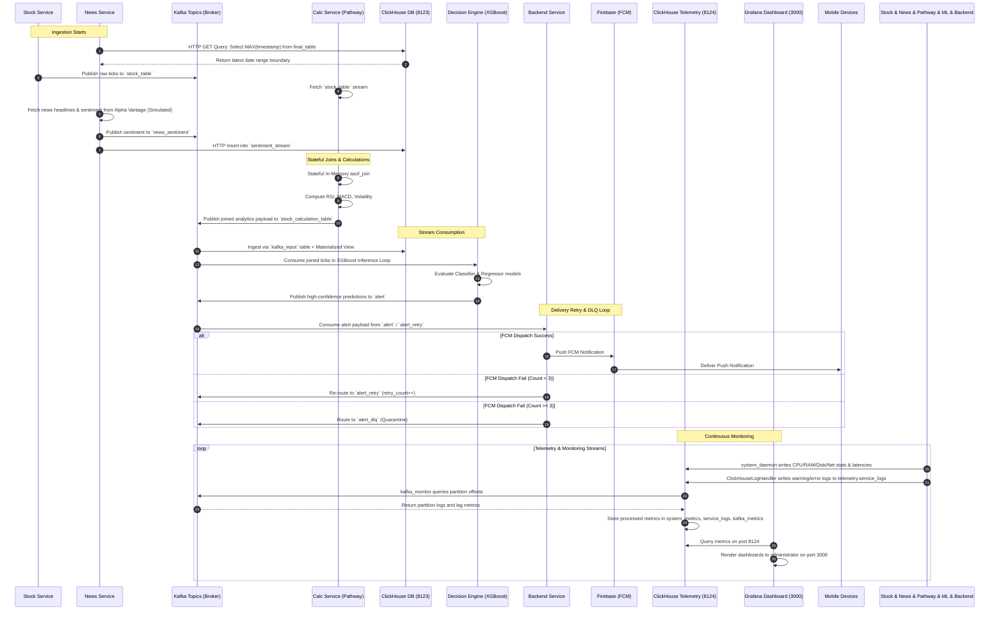

# 📈 Sentinel-Stream: Real-Time Quantitative Trading & Alerts Engine


-orange)


**Sentinel-Stream** is a production-grade, event-driven quantitative trading and alerts engine. Designed for high-throughput and low-latency, it leverages **Pathway (Rust)** for stateful sliding-window calculations (GARCH, ARMA, RSI, MACD), **Confluent Kafka** for real-time routing, and **ClickHouse** for analytical storage—all driving a dual-model **XGBoost** inference pipeline to deliver high-confidence market signals.

### 🧰 Tech Stack & Project Composition
Based on structural analysis, the codebase is composed of **15 core Python/Code modules**, orchestrated via **Docker & Docker Compose**, and divided into distinct layers:
*   **Ingestion:** Python-based Stock & News API Services.
*   **Computation:** Rust-accelerated Pathway Calculation Service.
*   **Intelligence:** XGBoost Decision Service.
*   **Alerts:** Firebase-integrated Backend Service.
*   **Infrastructure:** ClickHouse SQL schemas and Telemetry.

## Quick Start

The entire pipeline is containerized and orchestrated via Docker Compose.

### Requirements
- **Docker** and **Docker Compose**
- (Optional) **Python 3.11+** (only if running training scripts locally)

### Steps to Run
1. **Clone the repository**
2. **Start the pipeline**:
   ```bash
   docker-compose up -d --build
   ```
   *This command will pull the necessary images, build the microservices, and initialize the ClickHouse schema automatically.*

3. **Verify the services**:
   ```bash
   docker-compose ps
   ```

---

## 🏗️ System Architecture & Data Flow

```mermaid
flowchart TD
  %% Style Definitions
  classDef stock fill:#e0f2fe,stroke:#0284c7,stroke-width:2px,color:#0369a1,font-size:16px
  classDef news fill:#ffedd5,stroke:#ea580c,stroke-width:2px,color:#c2410c,font-size:16px
  classDef calc fill:#f3e8ff,stroke:#8b5cf6,stroke-width:2px,color:#6d28d9,font-size:16px
  classDef decision fill:#e0e7ff,stroke:#4f46e5,stroke-width:2px,color:#4338ca,font-size:16px
  classDef backend fill:#ffe4e6,stroke:#f43f5e,stroke-width:2px,color:#be123c,font-size:16px
  classDef kafka fill:#dcfce7,stroke:#22c55e,stroke-width:2px,color:#15803d,font-size:16px,font-weight:bold
  classDef db fill:#fae8ff,stroke:#d946ef,stroke-width:2px,color:#a21caf,font-size:16px,font-weight:bold
  classDef telemetry fill:#f1f5f9,stroke:#64748b,stroke-width:2px,color:#475569,font-size:15px
  classDef external fill:#fef08a,stroke:#ca8a04,stroke-width:2px,color:#854d0e,font-size:16px

  %% TIER 1: SOURCES & INGESTION MICROSERVICES
  subgraph Ingestion_Tier ["Tier 1: Ingestion Tier"]
    CSV[("merged_stock_popular_red.csv")]:::stock
    StockService["Stock Service (main.py)"]:::stock
    NewsService["News Service (main.py)"]:::news
    AlphaVantage[["Alpha Vantage API (Simulated)"]]:::external

    CSV -->|Replay minute OHLC at 5x| StockService
    AlphaVantage -.->|Fetch headlines & sentiment| NewsService
  end

  %% TIER 2: INGESTION QUEUES (KAFKA)
  subgraph Ingestion_Queues ["Tier 2: Ingestion Topics"]
    Topic_Stock["Kafka Topic: stock_table<br/>(Raw Ticks)"]:::kafka
    Topic_Sentiment["Kafka Topic: news_sentiment<br/>(AV Sentiment Ticks)"]:::kafka
  end

  StockService -->|Publish raw ticks| Topic_Stock
  NewsService -->|Publish sentiments| Topic_Sentiment

  %% TIER 3: STREAM PROCESSING & JOINS
  subgraph Processing_Tier ["Tier 3: Stream Processing & Joins"]
    PathwayEngine["Pathway Stream Engine (main.py)"]:::calc
    Indicators["indicators.py (RSI, MACD, EMA, GARCH)"]:::calc
    Schemas["schemas.py (Quote/News schemas)"]:::calc
    
    PathwayEngine <-->|Compute indicators| Indicators
    PathwayEngine -->|Enforce schemas| Schemas
  end

  Topic_Stock -->|Consume price ticks| PathwayEngine
  Topic_Sentiment -->|Consume news sentiments| PathwayEngine

  %% TIER 4: CALCULATION & SYNC TOPICS
  subgraph Calculation_Topics ["Tier 4: Calculation & Sync Topics"]
    Topic_Calculation["Kafka Topic: stock_calculation_table<br/>(Joined Analytics payload)"]:::kafka
  end

  PathwayEngine -->|Publish joined records| Topic_Calculation

  %% TIER 5: ANALYTICAL DATABASE & DECISION ENGINE
  subgraph ClickHouse_Store ["ClickHouse OLAP Database (Port 8123)"]
    Table_KafkaInput["Table: kafka_input<br/>(Kafka Engine)"]:::db
    MV_Kafka["Materialized View:<br/>mv_kafka_to_final"]:::db
    Table_Final["Table: final_table<br/>(Historical Analytics Store)"]:::db
    Table_Sentiment["Table: sentiment_stream<br/>(HTTP raw sentiments)"]:::db
    
    Table_KafkaInput -->|Natively trigger MV| MV_Kafka
    MV_Kafka -->|Persist final records| Table_Final
  end

  subgraph Decision_Engine ["XGBoost Decision Engine (decision_service)"]
    DecisionService["Decision Service (xgboost_mdl_inf.py)"]:::decision
    ClassifierModel["xgb_classifier_model.json"]:::decision
    RegressorModel["xgb_pct_change_model.json"]:::decision
    SymbolPickle["symbol_mapping.pkl"]:::decision
    
    DecisionService -->|Evaluate classification| ClassifierModel
    DecisionService -->|Predict price change| RegressorModel
    DecisionService -->|Align ticker categorical mappings| SymbolPickle
  end

  Topic_Calculation -->|Natively consume| Table_KafkaInput
  Topic_Calculation -->|Inference stream subscription| DecisionService
  NewsService -->|Active HTTP bulk inserts| Table_Sentiment
  NewsService -.->|Direct HTTP Query: Sync date range| Table_Final

  %% TIER 6: ALERT ROUTING & ERROR HANDLING (DLQ)
  subgraph Alert_Routing ["Tier 5: Alert Routing & Resilience"]
    Topic_Alert["Kafka Topic: alert<br/>(Trigger main notification)"]:::kafka
    Topic_AlertRetry["Kafka Topic: alert_retry<br/>(Exponential retry queue)"]:::kafka
    Topic_AlertDLQ["Kafka Topic: alert_dlq<br/>(Dead Letter Queue / Quarantine)"]:::kafka
  end

  DecisionService -->|Publish signals if price change > 2%| Topic_Alert

  %% TIER 7: DELIVERY SERVICE
  subgraph Delivery_Tier ["Tier 6: Delivery Tier"]
    BackendService["Backend Service (main.py)"]:::backend
    SendMessage["send_message.py"]:::backend
    FirebaseSDK["Firebase Admin SDK (firebase-admin-key.json)"]:::backend
    
    BackendService -->|Invoke FCM send| SendMessage
    SendMessage -->|Authenticate| FirebaseSDK
  end

  Topic_Alert -->|Consume fresh alerts| BackendService
  Topic_AlertRetry -->|Consume retries| BackendService
  BackendService -->|Push back if retry_count < 3| Topic_AlertRetry
  BackendService -->|Quarantine if retry_count >= 3| Topic_AlertDLQ

  %% External Entities
  FCM[["Firebase Cloud Messaging (FCM)"]]:::external
  Mobile[["Mobile Devices / Users"]]:::external

  FirebaseSDK -->|Dispatch notification| FCM
  FCM -->|Push alert| Mobile

  %% OBSERVABILITY & TELEMETRY CLUSTER (Isolated on port 8124 / 3000)
  subgraph Observability_Cluster ["Observability & Telemetry Cluster"]
    system_daemon["System Daemon (psutil)<br/>[Runs inside all containers]"]:::telemetry
    kafka_monitor["Kafka Lag Monitor (kafka_monitor.py)<br/>[Standalone container]"]:::telemetry
    ClickHouse_Monitor["ClickHouse Monitoring Database (Port 8124)"]:::telemetry
    Table_Latencies["Table: telemetry.pipeline_latencies<br/>(E2E delays, Compute delay)"]:::telemetry
    Table_Metrics["Table: telemetry.system_metrics<br/>(CPU, RAM, Disk, Net I/O)"]:::telemetry
    Table_KafkaMetrics["Table: telemetry.kafka_metrics<br/>(Consumer lag, throughput)"]:::telemetry
    Table_Logs["Table: telemetry.service_logs<br/>(Central error/exception sink)"]:::telemetry
    Grafana["Grafana Server (Port 3000)"]:::telemetry

    system_daemon -->|Insert CPU/RAM/Disk/Net stats| Table_Metrics
    system_daemon -->|Direct warning/error logs| Table_Logs
    kafka_monitor -->|Query broker partition lag| Table_KafkaMetrics
    ClickHouse_Monitor -->|Store latency metrics| Table_Latencies
    ClickHouse_Monitor -->|Store sys resource logs| Table_Metrics
    ClickHouse_Monitor -->|Store lag stats| Table_KafkaMetrics
    ClickHouse_Monitor -->|Store central service logs| Table_Logs
    Grafana -->|Query dashboard metrics| ClickHouse_Monitor
  end
```



### End-to-End Data Path



---

## 🔍 Deep Dive: Calculation Service

The **Calculation Service** is the analytical heart of the pipeline, leveraging Rust-backed **Pathway**. It performs continuous incremental computation rather than batch processing. 
*   **Temporal Joins:** Uses `asof_join` on `symbol` and `ts_ms` to combine asynchronous stock ticks with the latest news sentiment accurately.
*   **Windowed Metrics:** Calculates complex technical indicators (e.g., RSI, EMA, MACD, GARCH volatility) on rolling memory windows without needing external database calls.
*   **Upstream Emission:** The finished, fully-enriched feature vector is emitted directly to the `stock_calculation_table` topic.

---

## 🛡️ Engineering Excellence & Guardrails

Sentinel-Stream is built with strict defensive programming and infrastructure resilience:

*   **Stateless Inference Decoupling:** The XGBoost `decision_service` is completely decoupled from ClickHouse. It reads directly from Kafka, eliminating database polling threads, caches, and connection overhead from the critical ML path.
*   **Robust Orchestration & Failsafes:** Docker Compose enforces strict `depends_on` health checks. Downstream microservices *only* start once Kafka and ClickHouse report healthy, preventing startup race conditions and message drops.
*   **Type Safety & Schema Validation:** Data boundaries between microservices are enforced using Pydantic schemas (e.g., `QuoteSchema`, `NewsSentimentSchema`), ensuring malformed events are dropped before polluting the inference engine.
*   **Kafka-Based Retry Routing & DLQ:** Enforces dynamic Kafka-based retry topic routing (`alert_retry`) with incremental delay backoffs and a Dead Letter Queue (`alert_dlq`) for quarantine. This ensures transient network or API failures (e.g. downstream alert dispatches) do not block or crash the pipeline.
*   **Isolated Telemetry Tier:** Centralized logs, system resource metrics, and end-to-end latencies are sent to a completely dedicated `telemetry` database instance. This prevents diagnostic queries from competing with core financial queries.
*   **Dynamic Throttle Guardrails:** Simulation speed is dynamically configurable to prevent CPU starvation and buffer overflows in local Docker Desktop environments.

---

## ⚡ Performance Optimizations

*   **Stateful Memory Operations**: Displaces heavy data-joins upstream into Pathway, executing low-latency Rust-accelerated joins on active memory tables rather than expensive SQL queries.
*   **Dual-Model Concurrency**: The Decision service executes two separate XGBoost models simultaneously in memory, minimizing blocking I/O and processing lag.

---

## 🛠️ Configuration & Development

### Local Testing (Dummy Mode)
By default, the pipeline is configured for easy local testing without external dependencies:
- **Firebase**: `USE_DUMMY_FIREBASE=true` enables a mock alert system.
- **Stock Simulation**: `REPLAY_SPEEDUP=5.0` replays stock price updates at a stable 5x simulation speed.
- **News Mocking**: `USE_DUMMY_API=true` generates local simulated articles.

### Retraining the AI Models
If you have new data in ClickHouse and want to update the XGBoost models:
1. Enter the decision service container:
   ```bash
   docker-compose exec decision_service bash
   ```
2. Run the consolidated training script:
   ```bash
   python train_models.py
   ```
3. Restart the service to load new models:
   ```bash
   docker-compose restart decision_service
   ```

---

## 📊 Telemetry, Monitoring & Grafana

Sentinel-Stream features a dedicated telemetry and monitoring cluster (isolated on port `8124` for ClickHouse and `3000` for Grafana) to track pipeline execution without impacting core performance.

### Telemetry Database Tables (ClickHouse Monitoring)
You can directly query raw metrics stored in ClickHouse using the client:
```bash
docker-compose exec clickhouse_monitoring clickhouse-client -d telemetry -q "SHOW TABLES"
```
The database contains:
*   `telemetry.pipeline_latencies`: End-to-end latency, computation delay, and inference/delivery delay metrics.
*   `telemetry.system_metrics`: CPU, RAM, Disk, and Network RX/TX statistics.
*   `telemetry.kafka_metrics`: Consumer lag, high-water marks, and processing velocity.
*   `telemetry.service_logs`: Aggregated Warning/Error logs across all microservices.

### Grafana Dashboards
Grafana is pre-configured with a ClickHouse datasource and dashboards.
1. Open your browser and navigate to **`http://localhost:3000`**.
2. Log in with the default credentials:
   * **Username:** `admin`
   * **Password:** `admin`
3. Explore the following dashboards:
   * **01-Overview:** Global pipeline checkup and active status indicators.
   * **02-Latency Detail:** End-to-end event latencies and bottleneck analysis.
   * **03-Kafka Health:** Consumer lag tracking, throughput rates, and queue sizes.
   * **04-Resources:** CPU and RAM usage profiles across all containers.
   * **05-Alerts & Business Metrics:** Signal volumes, FCM dispatch retry/fail rates, and DLQ quarantine.

---

## 🧪 Integration & Performance Benchmarking

A complete benchmarking suite is provided to test the system under load, verify dead-letter queue routing via failure injection, and generate performance reports.

To run the benchmarking suite:
1. Trigger the benchmark script in the container:
   ```bash
   docker-compose exec kafka_monitor python /app/infra/run_benchmark.py
   ```
2. The benchmark will:
   * Inject a telemetry failure payload (`FAIL`) to verify that the Backend Service retries alerts up to 3 times and correctly routes persistent failures to `alert_dlq`.
   * Stream a high-speed burst of stock quotes to measure throughput and processing velocity.
   * Query the ClickHouse database to verify database persistence and print out system statistics.
   * Auto-generate a detailed markdown verification report in **`docs/monitoring_verification_report.md`**.
