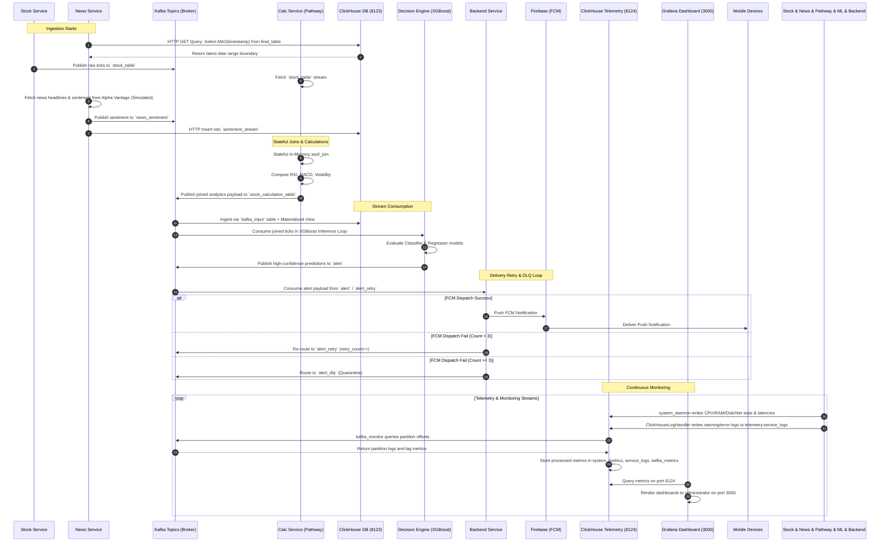

# Sentinel-Stream: Real-Time Investment Decision Pipeline Architecture

## 1. High-Level Architecture Diagram
This diagram outlines the complete real-time quantitative trading and alerts pipeline, highlighting the sub-structures, microservices, Kafka topics, ClickHouse tables, ML models, and notification configurations.

```mermaid
flowchart TD
  %% Style Definitions
  classDef stock fill:#e0f2fe,stroke:#0284c7,stroke-width:2px,color:#0369a1,font-size:16px
  classDef news fill:#ffedd5,stroke:#ea580c,stroke-width:2px,color:#c2410c,font-size:16px
  classDef calc fill:#f3e8ff,stroke:#8b5cf6,stroke-width:2px,color:#6d28d9,font-size:16px
  classDef decision fill:#e0e7ff,stroke:#4f46e5,stroke-width:2px,color:#4338ca,font-size:16px
  classDef backend fill:#ffe4e6,stroke:#f43f5e,stroke-width:2px,color:#be123c,font-size:16px
  classDef kafka fill:#dcfce7,stroke:#22c55e,stroke-width:2px,color:#15803d,font-size:16px,font-weight:bold
  classDef db fill:#fae8ff,stroke:#d946ef,stroke-width:2px,color:#a21caf,font-size:16px,font-weight:bold
  classDef telemetry fill:#f1f5f9,stroke:#64748b,stroke-width:2px,color:#475569,font-size:15px
  classDef external fill:#fef08a,stroke:#ca8a04,stroke-width:2px,color:#854d0e,font-size:16px

  %% TIER 1: SOURCES & INGESTION MICROSERVICES
  subgraph Ingestion_Tier ["Tier 1: Ingestion Tier"]
    CSV[("merged_stock_popular_red.csv")]:::stock
    StockService["Stock Service (main.py)"]:::stock
    NewsService["News Service (main.py)"]:::news
    AlphaVantage[["Alpha Vantage API (Simulated)"]]:::external

    CSV -->|Replay minute OHLC at 5x| StockService
    AlphaVantage -.->|Fetch headlines & sentiment| NewsService
  end

  %% TIER 2: INGESTION QUEUES (KAFKA)
  subgraph Ingestion_Queues ["Tier 2: Ingestion Topics"]
    Topic_Stock["Kafka Topic: stock_table<br/>(Raw Ticks)"]:::kafka
    Topic_Sentiment["Kafka Topic: news_sentiment<br/>(AV Sentiment Ticks)"]:::kafka
  end

  StockService -->|Publish raw ticks| Topic_Stock
  NewsService -->|Publish sentiments| Topic_Sentiment

  %% TIER 3: STREAM PROCESSING & JOINS
  subgraph Processing_Tier ["Tier 3: Stream Processing & Joins"]
    PathwayEngine["Pathway Stream Engine (main.py)"]:::calc
    Indicators["indicators.py (RSI, MACD, EMA, GARCH)"]:::calc
    Schemas["schemas.py (Quote/News schemas)"]:::calc
    
    PathwayEngine <-->|Compute indicators| Indicators
    PathwayEngine -->|Enforce schemas| Schemas
  end

  Topic_Stock -->|Consume price ticks| PathwayEngine
  Topic_Sentiment -->|Consume news sentiments| PathwayEngine

  %% TIER 4: CALCULATION & SYNC TOPICS
  subgraph Calculation_Topics ["Tier 4: Calculation & Sync Topics"]
    Topic_Calculation["Kafka Topic: stock_calculation_table<br/>(Joined Analytics payload)"]:::kafka
  end

  PathwayEngine -->|Publish joined records| Topic_Calculation

  %% TIER 5: ANALYTICAL DATABASE & DECISION ENGINE
  subgraph ClickHouse_Store ["ClickHouse OLAP Database (Port 8123)"]
    Table_KafkaInput["Table: kafka_input<br/>(Kafka Engine)"]:::db
    MV_Kafka["Materialized View:<br/>mv_kafka_to_final"]:::db
    Table_Final["Table: final_table<br/>(Historical Analytics Store)"]:::db
    Table_Sentiment["Table: sentiment_stream<br/>(HTTP raw sentiments)"]:::db
    
    Table_KafkaInput -->|Natively trigger MV| MV_Kafka
    MV_Kafka -->|Persist final records| Table_Final
  end

  subgraph Decision_Engine ["XGBoost Decision Engine (decision_service)"]
    DecisionService["Decision Service (xgboost_mdl_inf.py)"]:::decision
    ClassifierModel["xgb_classifier_model.json"]:::decision
    RegressorModel["xgb_pct_change_model.json"]:::decision
    SymbolPickle["symbol_mapping.pkl"]:::decision
    
    DecisionService -->|Evaluate classification| ClassifierModel
    DecisionService -->|Predict price change| RegressorModel
    DecisionService -->|Align ticker categorical mappings| SymbolPickle
  end

  Topic_Calculation -->|Natively consume| Table_KafkaInput
  Topic_Calculation -->|Inference stream subscription| DecisionService
  NewsService -->|Active HTTP bulk inserts| Table_Sentiment
  NewsService -.->|Direct HTTP Query: Sync date range| Table_Final

  %% TIER 6: ALERT ROUTING & ERROR HANDLING (DLQ)
  subgraph Alert_Routing ["Tier 5: Alert Routing & Resilience"]
    Topic_Alert["Kafka Topic: alert<br/>(Trigger main notification)"]:::kafka
    Topic_AlertRetry["Kafka Topic: alert_retry<br/>(Exponential retry queue)"]:::kafka
    Topic_AlertDLQ["Kafka Topic: alert_dlq<br/>(Dead Letter Queue / Quarantine)"]:::kafka
  end

  DecisionService -->|Publish signals if price change > 2%| Topic_Alert

  %% TIER 7: DELIVERY SERVICE
  subgraph Delivery_Tier ["Tier 6: Delivery Tier"]
    BackendService["Backend Service (main.py)"]:::backend
    SendMessage["send_message.py"]:::backend
    FirebaseSDK["Firebase Admin SDK (firebase-admin-key.json)"]:::backend
    
    BackendService -->|Invoke FCM send| SendMessage
    SendMessage -->|Authenticate| FirebaseSDK
  end

  Topic_Alert -->|Consume fresh alerts| BackendService
  Topic_AlertRetry -->|Consume retries| BackendService
  BackendService -->|Push back if retry_count < 3| Topic_AlertRetry
  BackendService -->|Quarantine if retry_count >= 3| Topic_AlertDLQ

  %% External Entities
  FCM[["Firebase Cloud Messaging (FCM)"]]:::external
  Mobile[["Mobile Devices / Users"]]:::external

  FirebaseSDK -->|Dispatch notification| FCM
  FCM -->|Push alert| Mobile

  %% OBSERVABILITY & TELEMETRY CLUSTER (Isolated on port 8124 / 3000)
  subgraph Observability_Cluster ["Observability & Telemetry Cluster"]
    system_daemon["System Daemon (psutil)<br/>[Runs inside all containers]"]:::telemetry
    kafka_monitor["Kafka Lag Monitor (kafka_monitor.py)<br/>[Standalone container]"]:::telemetry
    ClickHouse_Monitor["ClickHouse Monitoring Database (Port 8124)"]:::telemetry
    Table_Latencies["Table: telemetry.pipeline_latencies<br/>(E2E delays, Compute delay)"]:::telemetry
    Table_Metrics["Table: telemetry.system_metrics<br/>(CPU, RAM, Disk, Net I/O)"]:::telemetry
    Table_KafkaMetrics["Table: telemetry.kafka_metrics<br/>(Consumer lag, throughput)"]:::telemetry
    Table_Logs["Table: telemetry.service_logs<br/>(Central error/exception sink)"]:::telemetry
    Grafana["Grafana Server (Port 3000)"]:::telemetry

    system_daemon -->|Insert CPU/RAM/Disk/Net stats| Table_Metrics
    system_daemon -->|Direct warning/error logs| Table_Logs
    kafka_monitor -->|Query broker partition lag| Table_KafkaMetrics
    ClickHouse_Monitor -->|Store latency metrics| Table_Latencies
    ClickHouse_Monitor -->|Store sys resource logs| Table_Metrics
    ClickHouse_Monitor -->|Store lag stats| Table_KafkaMetrics
    ClickHouse_Monitor -->|Store central service logs| Table_Logs
    Grafana -->|Query dashboard metrics| ClickHouse_Monitor
  end
```

---

## 2. Service Sub-structures & File Mapping

### A. Stock Service (`src/code/stock_service`)
Simulates the real-time stock ticker stream by replaying historical stock price/volume data.
*   **`main.py`**: Reads pricing data from CSV and replays it at a $5\times$ simulation speed throttle to Kafka. It maps columns to `InputSchema`.
*   **`merged_stock_popular_red.csv`**: Source dataset containing historical minute-level stock pricing.

### B. News Service (`src/code/news_service`)
Ingests financial news feeds and sentiment scores from the Alpha Vantage API (simulated).
*   **`main.py`**: Ingests headlines, aligns timestamp fetches by querying ClickHouse's `final_table` directly, publishes aggregated sentiments to Kafka (`news_sentiment`), and pushes raw sentiment details directly to ClickHouse.
*   **`dummy_api.py`**: Simulates the Alpha Vantage market news feeds, outputting synthetic headlines, tickers, and pre-computed sentiments.

### C. Pathway Calculation Service (`src/code/calc_service`)
Performs high-performance in-memory stream computations.
*   **`main.py`**: The Pathway runtime engine which performs stateful `asof_join` on `symbol` and `ts_ms`.
*   **`indicators.py`**: Quantitative calculations:
    *   **RSI (Relative Strength Index)** with buy/sell indicators.
    *   **MACD (Moving Average Convergence Divergence)** with EMA averages.
    *   **GARCH/Volatility** metrics to capture variance.
*   **`schemas.py`**: Defines `QuoteSchema` and `NewsSentimentSchema` for type safety.

### D. Decision Engine (`src/code/decision_service`)
Evaluates pre-joined features using machine learning to trigger trading alerts.
*   **`xgboost_mdl_inf.py`**: Subscribes to `stock_calculation` to perform stateless evaluations.
*   **`train_models.py`**: Script used to train the classification and regression models.
*   **`xgb_classifier_model.json`**: XGBoost directional classification model.
*   **`xgb_pct_change_model.json`**: XGBoost percentage price change regressor.
*   **`symbol_mapping.pkl`**: Ticker mappings for categorical values.

### E. Backend Notification Service (`src/code/backend`)
Handles alert delivery and retry routing.
*   **`main.py`**: Listens to `alert` and `alert_retry` topics. Manages retry loop counters.
*   **`send_message.py`**: Uses Firebase Admin SDK to push notifications.
*   **`dummy_firebase.py`**: Simulates FCM notifications locally.

### F. ClickHouse Analytical Store (`src/code/infra`)
Analytical storage and telemetry database.
*   **`schema.sql`**: Database structure:
    *   `kafka_input`: ClickHouse Kafka Engine table linked to `stock_calculation_table`.
    *   `final_table`: Analytics store.
    *   `mv_kafka_to_final`: Materialized View transferring records from `kafka_input` to `final_table`.
    *   `sentiment_stream`: Direct storage for sentiment analysis logs.
*   **`monitoring_schema.sql`**: Configures tables for the telemetry cluster (`telemetry.pipeline_latencies`, `telemetry.system_metrics`, `telemetry.kafka_metrics`, and `telemetry.service_logs`).

### G. Telemetry & Monitoring Services (`src/code/infra`, `src/code/kafka_monitor`)
Provides isolated end-to-end monitoring, health check dashboards, and performance verification.
*   **`system_daemon.py`**: Background thread that harvests CPU %, RAM, Disk, and Network RX/TX metrics for each container via `psutil`.
*   **`telemetry_client.py`**: Thread-safe Singleton `TelemetryClient` that implements asynchronous batch inserts into ClickHouse monitoring tables.
*   **`kafka_monitor/`**: Service container running `kafka_monitor.py` to poll broker partition-level watermarks/offsets and calculate consumer lag.
*   **`run_benchmark.py`**: Integration validation, DLQ routing validation (via deterministic FCM failure injection), and clickhouse query performance verification.
*   **`grafana/`**: Contains ClickHouse datasources config and provisioned dashboards (Overview, System Resources, Latency, Kafka Health, Alert/Business metrics).

---

## 3. Production-Grade Resilience & Observability

### A. Kafka-Based Retry Topic Routing & DLQ
To handle downstream notification processing errors (e.g. transient network timeouts, rate-limiting on Firebase Cloud Messaging API):
1.  **Main Queue (`alert`)**: Initial predictions are consumed here.
2.  **Retry Queue (`alert_retry`)**: Failed dispatches are re-routed to `alert_retry` with an incremented `retry_count` (capped at 3).
3.  **Dead Letter Queue (`alert_dlq`)**: Notifications that fail 3 consecutive attempts are routed to `alert_dlq` for quarantine and manual inspection.

### B. Isolated Observability & Telemetry Cluster
To ensure monitoring queries do not compete with the high-frequency trading pipeline, observability is isolated on port `8124`:
1.  **`telemetry.pipeline_latencies`**: Monitors end-to-end latency, ingestion delay, calculation delay, inference delay, and FCM push delay.
2.  **`telemetry.system_metrics`**: Records CPU usage, RAM utilization, Disk usage, and Network I/O (rx/tx bytes) across all services.
3.  **`telemetry.kafka_metrics`**: Monitors partition offsets, consumer group offsets, consumer lags, and message throughput per second.
4.  **`telemetry.service_logs`**: Centralizes exception reports, stack traces, warnings, and errors across the microservices.

---

## 4. End-to-End Data Path

